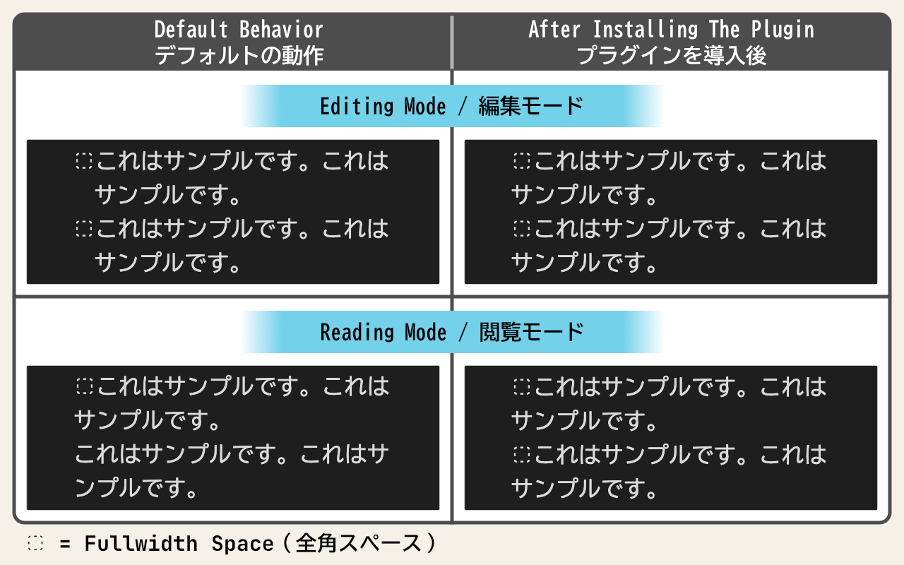

# Jisage -Japanese Indentation-

## Features / 機能概要

This plugin adds the following features to Obsidian.

このプラグインはObsidianに以下の機能を追加します

- Display “Jisage” (indenting with a full-width space at the beginning of a line) text correctly.

- 字下げ（行頭の全角スペースでインデントすること）された文章を正しく表示させます

## Installation / インストール方法

Obsidian Settings > Community plugins > Browse > Type 'jisage' into the search box > Select the 'Jisage -Japanese Indentation-' card > Install > Enable

Obsidianの設定 > コミュニティプラグイン > 閲覧 > 検索ボックスに「jisage」と入力 > 「Jisage -Japanese Indentation-」のカードを選択 > インストール > 有効化

## Usage / 使い方

It will work once you enable the plugin.

プラグインを有効化にすれば動作します

## Known Issues / 既知の問題

If you make edits that simply involve adding or removing a full-width space at the beginning of an existing sentence, the changes may not appear when you switch to Reading mode. This is a feature of Obsidian, and it does not appear to be an issue that can be resolved with a plugin. In this case, reopening the note will ensure that the edits are correctly reflected in Reading mode.

既存の文の先頭に全角スペースだけを追加または削除する編集を行った後、閲覧モードに切り替えると編集内容が反映されないことがあります。これはObsidianの仕様でありプラグインでは解決できそうにありません。この場合、ノートを開き直すことで閲覧モードにおいて編集内容が正しく反映されます。
